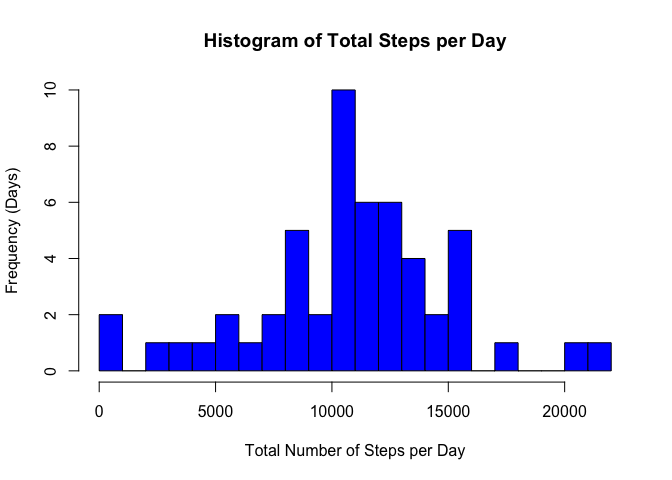
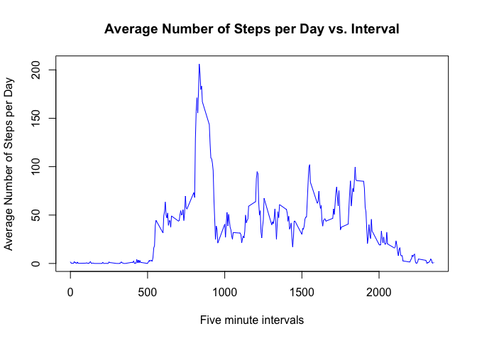
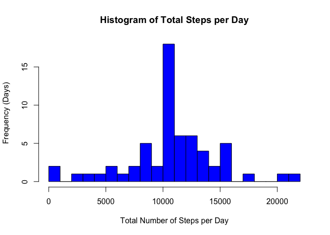
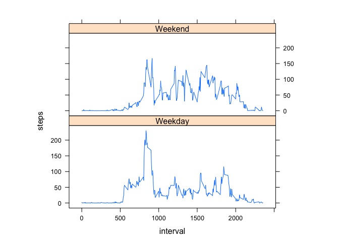

# ReproducibleResearchProject1


## Download file
First step is to download the file and process it.


```r
fileUrl <- "https://d396qusza40orc.cloudfront.net/repdata%2Fdata%2Factivity.zip"
download.file(fileUrl,"activity.zip",method="curl")
unzip("activity.zip")
activity <- read.csv("activity.csv",header=TRUE)
```

## What is mean total number of steps taken per day?
### Calculate the total number of steps taken per day
We will use the aggregate function to compute this.


```r
totalperday <- aggregate(steps ~ date, data = activity, FUN = sum, na.rm = TRUE)
totalperday
```

```
##          date steps
## 1  2012-10-02   126
## 2  2012-10-03 11352
## 3  2012-10-04 12116
## 4  2012-10-05 13294
## 5  2012-10-06 15420
## 6  2012-10-07 11015
## 7  2012-10-09 12811
## 8  2012-10-10  9900
## 9  2012-10-11 10304
## 10 2012-10-12 17382
## 11 2012-10-13 12426
## 12 2012-10-14 15098
## 13 2012-10-15 10139
## 14 2012-10-16 15084
## 15 2012-10-17 13452
## 16 2012-10-18 10056
## 17 2012-10-19 11829
## 18 2012-10-20 10395
## 19 2012-10-21  8821
## 20 2012-10-22 13460
## 21 2012-10-23  8918
## 22 2012-10-24  8355
## 23 2012-10-25  2492
## 24 2012-10-26  6778
## 25 2012-10-27 10119
## 26 2012-10-28 11458
## 27 2012-10-29  5018
## 28 2012-10-30  9819
## 29 2012-10-31 15414
## 30 2012-11-02 10600
## 31 2012-11-03 10571
## 32 2012-11-05 10439
## 33 2012-11-06  8334
## 34 2012-11-07 12883
## 35 2012-11-08  3219
## 36 2012-11-11 12608
## 37 2012-11-12 10765
## 38 2012-11-13  7336
## 39 2012-11-15    41
## 40 2012-11-16  5441
## 41 2012-11-17 14339
## 42 2012-11-18 15110
## 43 2012-11-19  8841
## 44 2012-11-20  4472
## 45 2012-11-21 12787
## 46 2012-11-22 20427
## 47 2012-11-23 21194
## 48 2012-11-24 14478
## 49 2012-11-25 11834
## 50 2012-11-26 11162
## 51 2012-11-27 13646
## 52 2012-11-28 10183
## 53 2012-11-29  7047
```

### Histogram of the total number of steps taken each day
We can just use the hist function for this plot.

```r
hist(totalperday$steps,
     breaks=20,
     col="blue",
     xlab="Total Number of Steps per Day",
     ylab="Frequency (Days)",
     main="Histogram of Total Steps per Day")
```

<!-- -->

### Calculate and report the mean and median of the total number of steps taken per day
We can just use the mean and median functions.


```r
meansteps <- mean(totalperday$steps)
meansteps
```

```
## [1] 10766.19
```

```r
medsteps <- median(totalperday$steps)
medsteps
```

```
## [1] 10765
```

## What is the average daily activity pattern?
### Time series plot of the average number of steps taken
This time we aggregate on interval instead of date.


```r
totalperinterval <- aggregate(steps ~ interval, data = activity, FUN = mean, na.rm = TRUE)
plot(totalperinterval$interval,
    totalperinterval$steps,
    type="l",
    col="blue",
    xlab="Five minute intervals",
    ylab="Average Number of Steps per Day",
    main="Average Number of Steps per Day vs. Interval")
```

<!-- -->

### The 5-minute interval that, on average, contains the maximum number of steps

```r
maxsteps <- totalperinterval$interval[which.max(totalperinterval$steps)]
maxsteps
```

```
## [1] 835
```

## Imputing missing values
### Calculate and report the total number of missing values in the dataset (i.e. the total number of rows with 𝙽𝙰s)

```r
nummissing <- sum(is.na(activity$steps))
nummissing
```

```
## [1] 2304
```

### Code to describe and show a strategy for imputing missing data
### Create a new dataset that is equal to the original dataset but with the missing data filled in
Let's just replace with the mean for each interval. It turns out if you try this by date, there are a few NaNs still.


```r
missing <- is.na(activity$steps)
activity_imputed <- activity
intervalmean <- tapply(activity_imputed$steps, activity_imputed$interval, mean, na.rm = TRUE)
activity_imputed$steps[missing] <- intervalmean[as.character(activity_imputed$interval[missing])]
```

### Histogram of the total number of steps taken each day after missing values are imputed
We can make the relevant changes to the histogram above and replot it.


```r
totalperday_imputed <- aggregate(steps ~ date, data = activity_imputed, FUN = sum, na.rm = TRUE)
hist(totalperday_imputed$steps,
     breaks=20,
     col="blue",
     xlab="Total Number of Steps per Day",
     ylab="Frequency (Days)",
     main="Histogram of Total Steps per Day")
```

<!-- -->

Impact of imputing: If we look at the mean and median of the imputed data, we see that they changed very little (they should not have).


```r
meansteps_imputed <- mean(totalperday_imputed$steps)
meansteps_imputed
```

```
## [1] 10766.19
```

```r
medsteps_inputed <- median(totalperday_imputed$steps)
medsteps_inputed
```

```
## [1] 10766.19
```

## Are there differences in activity patterns between weekdays and weekends?
### new factor variable in the dataset with two levels – “weekday” and “weekend”
Reformat the date and use weekdays function.


```r
activity_imputed$date <- as.Date(activity_imputed$date, "%Y-%m-%d")
activity_imputed$daytype <- ifelse(weekdays(activity_imputed$date)=="Saturday" | weekdays(activity_imputed$date)=="Sunday", "Weekend", "Weekday")
```

### Panel plot comparing the average number of steps taken per 5-minute interval across weekdays and weekends
Same thing as before


```r
totalperinterval_imputed <- aggregate(steps ~ interval + daytype, data = activity_imputed, FUN = mean, na.rm = TRUE)
library(lattice)
xyplot(steps ~ interval | factor(daytype), 
       data = totalperinterval_imputed, 
       aspect = 0.4,
       type = "l")
```

<!-- -->
